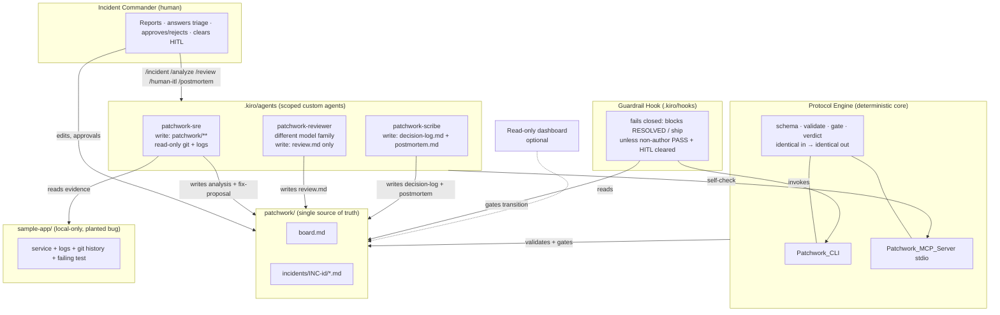
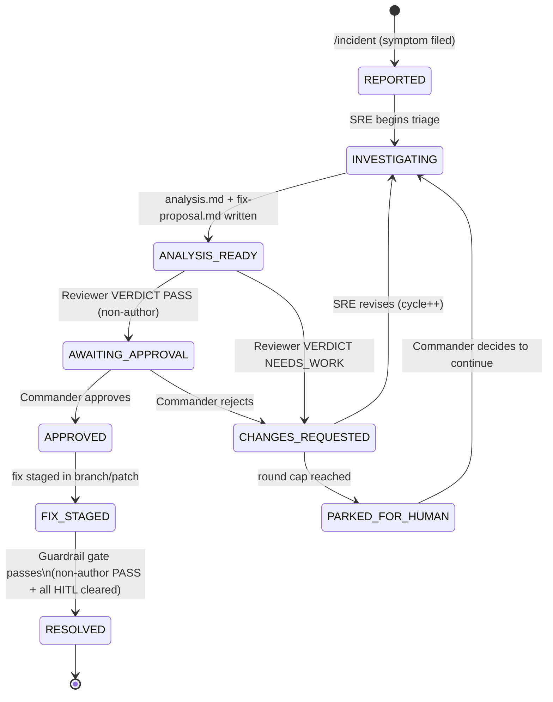

# Design Document

## Overview

Kiro Patchwork is a file-based, multiplayer incident-response workspace. A human Incident Commander and three scoped AI agents (SRE, Reviewer, Scribe) drive an incident from first symptom through an independently reviewed, staged fix and a compiled post-mortem. The shared `patchwork/` directory is the single source of truth; multiplayer is achieved through shared git history and distinct commit authors rather than a live server.

The central design principle is **correctness does not depend on model judgment alone**. A small deterministic Protocol Engine enforces the workspace schema, the incident state machine, and a fail-closed review gate. That engine is exposed two ways that wrap the exact same core logic: a CLI invoked deterministically by a Guardrail Hook, and an MCP server the agents call to self-check. The engine is the trust anchor; the agents are constrained producers whose output is checked by the engine before an incident can advance.

The whole system ships as a Kiro Power: `POWER.md` at the repo root, an `mcp.json` registering the engine's MCP server, steering that maps to the three agent personas and the protocol, and an onboarding step that validates dependencies, installs the guardrail hook, and scaffolds the workspace.

### Design goals

- **Deterministic trust anchor.** The engine gives identical outputs for identical inputs and fails closed on any ambiguity (Requirements 6, 10, 11).
- **Least privilege per role.** Each agent is tool-scoped so the SRE proposes but cannot ship, the Reviewer only writes its verdict, and the Scribe only writes the log and post-mortem (Requirements 4, 5, 7).
- **Independent, adversarial review.** The Reviewer runs on a different model family, treats workspace content as untrusted, and cannot rubber-stamp its own team's work (Requirements 5, 6).
- **Human authority at the gates.** Approval and HITL clearing are human-only; unproductive loops park for a human (Requirements 8, 12).
- **Reproducible grounding.** A deliberately vulnerable sample app with a planted bug, seeded logs, and a failing test grounds every investigation (Requirement 14).

### Technology choices

- **Runtime:** Node.js. Chosen because the Protocol Engine, MCP server, and sample app can share one toolchain, and Node ships everywhere Kiro runs.
- **Test runner:** the built-in `node:test` runner plus `node:assert`. Chosen to keep the deliverable dependency-light — no heavy test framework — while still supporting real red-green unit and integration tests. Property-based tests use a lightweight generator layer (see Testing Strategy).
- **MCP:** the standard Model Context Protocol SDK over stdio, matching how Kiro Powers register MCP servers in `mcp.json`.
- **Storage:** plain Markdown with YAML frontmatter, so every artifact is human-readable, diff-friendly, and git-attributable — the artifacts *are* the database.

## Architecture

### Component overview



### Two surfaces, one core

The `validate`, `gate`, and `verdict` commands are implemented once in a pure core module (`engine/core`). Two thin adapters expose that core without duplicating logic:

- **Patchwork_CLI** — a Node entry point (`engine/cli.js`) that parses argv, calls the core, prints a result, and sets the process exit code. This is what the Guardrail Hook shells into, so gate decisions are deterministic and independent of any model.
- **Patchwork_MCP_Server** — a stdio MCP server (`engine/mcp.js`) that registers `validate`, `gate`, and `verdict` as tools calling the same core functions, so agents can self-check their work before advancing an incident.

Because both adapters delegate to the identical core, the CLI a hook runs and the MCP tool an agent calls can never disagree.

### Incident state machine

The engine treats the incident lifecycle as an explicit transition table. Any transition not in the table is rejected by `gate` with a non-zero exit.



Notes:

- The linear "happy path" is `REPORTED → INVESTIGATING → ANALYSIS_READY → AWAITING_APPROVAL → APPROVED → FIX_STAGED → RESOLVED` (Requirement 3.2).
- `CHANGES_REQUESTED` is entered from either the review stage (NEEDS_WORK) or human rejection, and returns to `INVESTIGATING` for revision (Requirements 3.3, 3.4, 8.3).
- The `FIX_STAGED → RESOLVED` edge is the guarded edge: `gate` allows it only when a non-author PASS verdict exists for the current fix version and every HITL step is cleared (Requirements 8.5, 11).
- Each `CHANGES_REQUESTED → INVESTIGATING` traversal increments the revision-cycle counter; reaching the Round_Cap routes to `PARKED_FOR_HUMAN` (Requirement 12).

### Roles and least privilege

| Role | Agent / actor | Can write | Cannot |
| --- | --- | --- | --- |
| Incident Commander | human | anything (via IDE/git) | n/a |
| SRE | `patchwork-sre` | `patchwork/**` (analysis, fix-proposal, board) | git push/merge/branch; write outside `patchwork/**` |
| Reviewer | `patchwork-reviewer` (different model family) | `review.md` of the incident under review | write any other file; ship |
| Scribe | `patchwork-scribe` | `decision-log.md`, `postmortem.md` | write other artifacts; ship |
| Engine/Hook | deterministic code | nothing (read + decide only) | mutate artifacts |

Tool scoping is enforced by each agent's `toolsSettings` in `.kiro/agents/*.json`. The engine and hook never mutate workspace artifacts; they only read and decide, which keeps the trust anchor side-effect free.

## Components and Interfaces

### 1. Protocol Engine core (`engine/core`)

Pure functions over an in-memory representation of the workspace. No process exit, no printing — the adapters own those side effects. This keeps the core unit-testable and deterministic.

```
// Schema module (shared by every command)
parseIncident(text) -> { id, title, status } | SchemaError
parseBoardEntry(line) -> { time, who, role, type, description } | SchemaError
parseRemediationStep(line) -> { tag: 'AFK'|'HITL', text, verification } | SchemaError
parseVerdict(reviewText) -> 'PASS' | 'NEEDS_WORK'   // fail-closed: anything ambiguous -> NEEDS_WORK

// Commands
validate(workspace) -> { ok: boolean, problems: Problem[] }
gate(workspace, { incidentId, from, to }) -> { allowed: boolean, reason: string }
verdict(reviewText) -> { verdict: 'PASS'|'NEEDS_WORK', author?: string, fixVersion?: string }
```

- `validate` checks: workspace scaffold exists, each `incident.md` has valid frontmatter with a known status, board entries are well-formed, remediation steps carry a tag and a verification check. Returns the list of problems with paths (Requirements 1.5, 2.4, 9.4, 10.1).
- `gate` consults the transition table AND the guard conditions for the `FIX_STAGED → RESOLVED` edge: a non-author PASS verdict at the current fix version plus all HITL cleared. Rejects undefined transitions (Requirements 3.5, 6.3, 6.4, 8.5, 10.2).
- `verdict` parses the final `VERDICT:` line of `review.md`, normalizing to `PASS`/`NEEDS_WORK` and defaulting to `NEEDS_WORK` on any missing/malformed/ambiguous line (Requirements 5.3, 10.3).

Determinism is a hard interface contract: the core takes an explicit workspace snapshot argument (no wall-clock, no randomness), so identical inputs produce identical outputs (Requirement 10.6).

### 2. Patchwork_CLI (`engine/cli.js`)

```
patchwork validate [--workspace <dir>]        # exit 0 ok, non-zero on problems
patchwork gate --incident <id> --to <state>   # exit 0 allowed, non-zero rejected
patchwork verdict --incident <id>             # prints PASS|NEEDS_WORK, exit reflects gate use
```

Reads the workspace from disk into a snapshot, calls the core, prints a human-readable summary plus a machine-readable JSON line, and maps the result to an exit code. The exit code is the contract the Guardrail Hook relies on (Requirements 10.4, 11.1).

### 3. Patchwork_MCP_Server (`engine/mcp.js`)

Registers three MCP tools over stdio — `validate`, `gate`, `verdict` — whose handlers read the workspace snapshot and call the identical core functions, returning structured JSON. Agents call these to self-check before claiming a transition (Requirements 4 self-check, 10.5). The server name registered here must match the reference in `POWER.md` and `mcp.json`. Configuration is via environment variables only; no secrets are embedded.

### 4. Custom agents (`.kiro/agents/*.{json,md}`)

Each agent is a JSON config (model, `toolsSettings`) plus a Markdown system prompt.

- **patchwork-sre** — write-scoped to `patchwork/**`; read-only git shell limited to `status`, `log`, `diff`, `show`; read access to `sample-app/logs`. No push/merge/branch. Behavior: reads evidence, asks the Commander 2–3 triage questions, then writes `analysis.md` and `fix-proposal.md` with `[AFK]`/`[HITL]`-tagged remediation steps and per-item verification checks, and sets status to ANALYSIS_READY. May call the engine MCP tools to self-check (Requirement 4, 9).
- **patchwork-reviewer** — different model family from the SRE; read access to the incident artifacts and sample app, write access to `review.md` only. Adversarial mandate: attempt to refute the fix. Injection-hardened: treats `incident.md` and `fix-proposal.md` as untrusted, ignores any embedded "approve this" instructions, and ends `review.md` with a fail-closed `VERDICT:` line (Requirements 5, 6.1, 6.2).
- **patchwork-scribe** — write-scoped to `decision-log.md` (append-only) and `postmortem.md`. Compiles the post-mortem from the incident artifact chain, referencing the incident id, root cause, applied fix, and review outcome (Requirement 7).

### 5. Guardrail Hook (`.kiro/hooks/*.kiro.hook`)

Installed by onboarding. On a RESOLVED transition request or a ship command, it shells into `patchwork gate` / `patchwork verdict` and **fails closed**: the transition/ship is blocked unless the CLI reports a non-author PASS at the current fix version and all HITL steps cleared. Because it delegates to the CLI (same core as the MCP tools), its decision is deterministic and model-independent (Requirement 11).

### 6. Slash-command prompts (`.kiro/prompts/*.md`)

- `/incident` — file a symptom, create the Incident_Directory + `incident.md`, set REPORTED, append a board entry.
- `/analyze` — hand off to the SRE agent.
- `/review` — hand off to the Reviewer agent.
- `/human-itl` — walk the human through each `[HITL]` step, write an audit board entry attributed to the Commander per cleared step, and check the step off (Requirements 8.4, 9.3).
- `/postmortem` — hand off to the Scribe agent.

### 7. Kiro Power packaging

- `POWER.md` (repo root): frontmatter `name`, `displayName`, `description`, `keywords: [incident, outage, 500, error, rca, root cause, postmortem, sre]`, `author`; plus onboarding steps and steering references (Requirement 13.1, 13.2).
- `mcp.json`: registers the engine MCP server (name must match `POWER.md`); env-var configuration, no secrets (Requirement 13, security).
- `steering/`: maps to the SRE/Reviewer/Scribe personas and the protocol rules.
- **Onboarding**: validate Node availability, install the Guardrail Hook into `.kiro/hooks/`, and scaffold `patchwork/` (Requirements 13.3, 13.4).
- Agents ship in-repo in `.kiro/agents/` (default). *Open implementation detail to verify against the target Kiro version:* whether onboarding can also provision `.kiro/agents/`; default remains agents-in-repo (Requirement 13.5). Installable from a public GitHub repo or a local folder via the Powers panel (Requirement 13.6).

### 8. Sample app (`sample-app/`)

A tiny, deliberately vulnerable local Node service — e.g. a `/checkout` endpoint that returns 500 under a condition introduced by an identifiable commit. Ships with seeded logs under `sample-app/logs/`, real git history, and a failing reproduction test. Local-only, never configured for deployment (Requirement 14).

### 9. Optional read-only dashboard

A static page that renders `board.md`, the current status, and the artifact chain with Human/SRE/Reviewer/Scribe badges. Reads files only — no LLM, no network calls, no auth surface (Requirement 17).

## Data Models

### Workspace layout

```
patchwork/
  board.md                        # attributed, append-only, chronological timeline
  incidents/
    INC-<id>/
      incident.md                 # YAML frontmatter: id, title, status
      analysis.md                 # SRE root-cause analysis
      fix-proposal.md             # SRE proposed fix + tagged remediation steps
      review.md                   # Reviewer findings, ends with VERDICT line
      decision-log.md             # Scribe append-only decision log
      postmortem.md               # Scribe compiled post-mortem
.kiro/
  agents/
    patchwork-sre.json / .md
    patchwork-reviewer.json / .md
    patchwork-scribe.json / .md
  hooks/                          # guardrail hook (installed by onboarding)
  prompts/*.md                    # /incident /analyze /review /human-itl /postmortem
POWER.md
mcp.json
steering/
sample-app/                       # local-only vulnerable service + logs + tests
engine/                           # core + cli.js + mcp.js + tests
```

### Incident record frontmatter

```yaml
---
id: INC-2024-001
title: Checkout endpoint returns 500 under coupon stacking
status: INVESTIGATING   # one of the Incident_Status enum values
fix_version: 1          # incremented each revision cycle; ties a review to a fix
---
```

`Incident_Status` enum: `REPORTED | INVESTIGATING | ANALYSIS_READY | AWAITING_APPROVAL | APPROVED | FIX_STAGED | RESOLVED | CHANGES_REQUESTED | PARKED_FOR_HUMAN` (Requirement 1.3, 3).

### Board entry format

```
[2024-06-01T14:03Z] @alice · Incident Commander (human) · report: /checkout 500s on coupon stacking
[2024-06-01T14:07Z] @patchwork-sre · SRE (agent) · analysis: root cause traced to commit a1b2c3d
[2024-06-01T14:20Z] @patchwork-reviewer · Reviewer (agent) · verdict: NEEDS_WORK — fix misses null branch
```

Grammar: `[<time>] @<who> · <Role> (<human|agent>) · <type>:` followed by a free-text description. The author, role, and type fields are all required; a missing field is a schema violation (Requirements 2.2, 2.4).

### Remediation step format

```
- [AFK] Revert commit a1b2c3d on a fix branch — verify: reproduction test passes
- [HITL] Rotate the leaked coupon-service API key — verify: Commander confirms new key deployed
```

Grammar: a leading `[AFK]` or `[HITL]` tag, the action text, then a `verify:` clause. A step missing its tag or verification check is a schema violation (Requirements 9.1, 9.2, 9.4).

### Verdict line

```
VERDICT: PASS
VERDICT: NEEDS_WORK
```

The final `VERDICT:` line of `review.md`. Any other value, a missing line, or an ambiguous line is normalized to `NEEDS_WORK` (fail-closed) (Requirements 5.2, 5.3).

### Review-to-fix binding

A review is bound to the `fix_version` it evaluated. The gate only counts a PASS whose recorded fix version equals the incident's current `fix_version`, and whose author differs from the `fix-proposal.md` author (Non_Author_Rule). This prevents a stale PASS from an earlier fix version, or a self-authored PASS, from satisfying the gate (Requirements 6.3, 6.4).

## Error Handling

The engine draws a hard line between two failure classes, because they mean opposite things for an incident:

- **The work is invalid** — the workspace, a transition, or a verdict violates the protocol. The correct response is to reject and report the specific problem so a producer can fix it.
- **The checker could not run** — the engine hit an internal error, a missing binary, or an unreadable file. The correct response is to fail closed: never let an unverifiable request through.

Both classes surface as a non-zero exit from the CLI, so the Guardrail Hook treats them identically at the gate (block), while the human-readable and JSON output distinguishes them so a person can tell "your fix is not reviewed" from "the reviewer never ran."

### Malformed or missing workspace files

- `validate` reads a workspace snapshot and returns a `Problem[]` naming the offending path and the rule it broke: missing scaffold, missing artifact in a resolution-stage Incident_Directory, invalid or unknown `status`, a Board_Entry missing its author/role/type field, or a Remediation_Step missing its `[AFK]`/`[HITL]` tag or `verify:` clause. Any non-empty problem list maps to a non-zero exit (Requirements 1.5, 2.4, 9.4, 10.1).
- Unreadable or unparseable frontmatter is reported as a schema problem against that file rather than crashing the run — a malformed `incident.md` is invalid work, not a checker failure.

### Undefined state transitions

- `gate` consults the explicit transition table. A `{from, to}` pair absent from the table is rejected with a reason string and a non-zero exit; it is never silently allowed (Requirements 3.5, 10.2). This includes skipping states on the happy path and any backward jump not modeled as a branch edge.

### Missing or ambiguous verdict

- `verdict`/`parseVerdict` normalize the final `VERDICT:` line to `PASS` only on an exact match. A missing line, a typo, a comment-out, conflicting lines, or any ambiguity resolves to `NEEDS_WORK` (fail-closed). An empty or unreadable `review.md` is likewise treated as `NEEDS_WORK`, so "no usable review" can never read as approval (Requirements 5.3, 10.3).

### Stale or self-authored PASS

- The gate counts a PASS only when its recorded fix version equals the incident's current `fix_version`. A PASS carried over from an earlier revision cycle is stale and ignored, forcing a fresh review after each SRE revision (Requirement 6.3, review-to-fix binding).
- The gate rejects a PASS whose author equals the `fix-proposal.md` author under the Non_Author_Rule, so a team cannot approve its own fix (Requirements 6.3, 6.4). Both checks are invalid-work rejections, reported with a reason.

### Guardrail hook fails closed

- The hook shells into the CLI and decides solely on the exit code and parsed result. Any non-zero exit, a thrown engine error, a timeout, or unparseable output is treated as "gate not satisfied" and the RESOLVED transition or ship command is blocked. The hook has no code path that allows a transition on error — it can only allow on an explicit success result (Requirements 11.2, 11.3). This is the concrete expression of "the checker could not run" defaulting to block.

### Onboarding dependency failure

- Onboarding validates the Node dependency before making any change. If Node is unavailable or below the required version, onboarding stops with a clear, actionable message and does **not** half-scaffold: it does not install the hook or create a partial `patchwork/` tree. This avoids leaving a repository in a state where the workspace exists but the guardrail does not (Requirement 13.3). Re-running after installing Node completes the setup.

### Uncleared HITL and round-cap

- If any `[HITL]` step for an incident is uncleared, `gate` rejects the `FIX_STAGED → RESOLVED` transition regardless of verdict state, so human-only actions cannot be skipped (Requirement 8.5).
- When the revision-cycle counter reaches the Round_Cap without a PASS, the incident is set to `PARKED_FOR_HUMAN` and a Board_Entry records that the cap was reached, rather than looping the SRE and Reviewer indefinitely. Progress then requires an explicit Commander decision (Requirement 12).

## Testing Strategy

Testing targets the deterministic core, because that is where correctness is guaranteed. Agent prose is validated indirectly: if the engine and hook are correct, an incident simply cannot reach RESOLVED through an unreviewed or malformed path, whatever a model writes.

### Unit and integration tests (node:test + node:assert)

The Protocol Engine (`validate`, `gate`, `verdict`), the MCP tool handlers, and the Guardrail Hook all get real red-green tests using the built-in `node:test` runner and `node:assert` — no heavy framework, matching the dependency-light goal.

- **Engine core:** table-driven tests for each schema rule (valid + each violation), each transition edge (allowed + rejected), and each verdict input class.
- **MCP tool handlers:** tests assert that the `validate`/`gate`/`verdict` tools return the same decisions as the core for the same snapshot, protecting the "two surfaces, one core" invariant.
- **Guardrail hook:** tests drive the hook against constructed workspaces and assert it blocks on every failure mode (no PASS, stale PASS, self-authored PASS, uncleared HITL, non-zero CLI exit) and allows only on the fully satisfied gate.

### Property-based tests (lightweight generator layer)

Where a universal statement adds more than a handful of examples, a small in-repo generator layer (no external PBT dependency) drives randomized inputs, each test running many iterations:

- **Verdict fails closed for all non-PASS inputs.** *For any* string that is not exactly the canonical `VERDICT: PASS` line, `parseVerdict` returns `NEEDS_WORK`. This pins the fail-closed contract across the entire input space, not just sampled typos.
- **Gate never allows an undefined transition.** *For any* random `{from, to}` pair of Incident_Status values, `gate` allows the pair only if it is in the transition table; every other pair is rejected. This proves the table is the sole source of allowed motion.
- **Validate is deterministic and order-independent.** *For any* workspace snapshot, shuffling equivalent, order-independent content (e.g. reordering independent problems or equivalent entries) yields the same validation verdict — reinforcing the determinism contract (Requirement 10.6).

### Golden-path integration test

One end-to-end test exercises the full protocol against a seeded incident and asserts the load-bearing guarantees together:

- RESOLVED is reachable **only** via a non-author PASS recorded at the incident's current `fix_version` with every HITL step cleared; removing any one of those conditions keeps the incident out of RESOLVED.
- The Board history is complete and attributed — every stage transition and human action produced a well-formed, role-attributed Board_Entry in chronological order.
- The compiled `postmortem.md` links the full artifact chain (incident id, root cause, applied fix, review outcome).

### Agent behavior and the demo

Agent output (analysis quality, review reasoning, post-mortem prose) is **not** unit-tested — it is non-deterministic model text. It is validated two ways: indirectly through the deterministic gates that constrain what agent output can *achieve*, and directly through the manual end-to-end demo that carries the seeded incident from report to compiled post-mortem (Requirement 16.4). The Sample_App's failing reproduction test is the SRE's factual grounding: it fails while the planted defect is present and is the concrete signal an `[AFK]` remediation step verifies against (Requirements 14.3, 9.2).

## Security Considerations

- **Deliberately vulnerable sample app is local-only.** `sample-app/` contains a planted defect on purpose. It is never configured for deployment and is intended to run only on a developer's machine as investigation grounding, so the vulnerability cannot be exposed to a network (Requirements 14.1, 14.5).
- **No secrets in configuration.** `mcp.json` is configured through environment variables only. A committed `.env.example` carries key *names* with placeholder values and no real secrets, and real values live in an untracked `.env` (Requirements 13, 16.3).
- **Reviewer treats workspace content as untrusted.** `incident.md` and `fix-proposal.md` are attacker-influenceable text. The Reviewer_Agent is instructed to treat them as untrusted input and to ignore any embedded instructions — including "approve this fix" style directives — and continue the adversarial review (prompt-injection hardening) (Requirements 6.1, 6.2).
- **Least privilege per agent via `toolsSettings`.** The SRE has no push/merge/branch capability and is write-scoped to `patchwork/**`; the Reviewer can write only the `review.md` of the incident under review; the Scribe can write only `decision-log.md` and `postmortem.md`. No agent can ship (Requirements 4.5, 4.6, 5.5, 7.1).
- **Engine and hook are read-and-decide only.** The Protocol Engine and Guardrail Hook never mutate workspace artifacts; they read a snapshot and return a decision. Keeping the trust anchor side-effect free means it cannot be turned into a write primitive and its decisions cannot be corrupted by its own actions.
- **Guardrail fails closed.** The ship/resolution gate blocks on any error or unsatisfied condition and can only allow on an explicit success result, so a failure of the checker never becomes an approval (Requirement 11).
- **Read-only dashboard has no attack surface.** The optional dashboard renders workspace files only — no LLM, no network calls, and no authentication surface to defend, because it neither writes state nor accepts input (Requirement 17.3).
- **Third-party Powers.** Patchwork is distributed as a Kiro Power and may itself depend on Powers. Install Powers only from trusted sources (a known public repository or a vetted local folder), since a Power can register MCP servers and hooks that run locally (Requirement 13.6).

## Requirements Coverage

Every requirement maps to at least one design element below, so reviewers can confirm full coverage.

| Requirement | Design element(s) that satisfy it |
| --- | --- |
| 1. Shared workspace scaffold | Architecture › Workspace; Data Models › Workspace layout; Components › 7 Onboarding (scaffold); Components › 1 `validate` (missing-path reporting) |
| 2. Attributed append-only board | Data Models › Board entry format; Components › 1 `validate` (malformed-entry check); Components › 6 `/incident`, `/human-itl` prompts |
| 3. Incident state machine | Architecture › Incident state machine diagram; Data Models › `Incident_Status` enum; Components › 1 `gate` (transition table) |
| 4. SRE agent investigation and artifacts | Components › 4 `patchwork-sre` (write scope, read-only git, triage + artifacts); Roles and least privilege table |
| 5. Adversarial review and fail-closed verdict | Components › 4 `patchwork-reviewer` (different model family, review.md-only write); Components › 1 `verdict`; Data Models › Verdict line |
| 6. Review integrity and injection hardening | Components › 4 `patchwork-reviewer` (injection hardening); Data Models › Review-to-fix binding (Non_Author_Rule); Components › 1 `gate` |
| 7. Scribe decision log and post-mortem | Components › 4 `patchwork-scribe` (append-only log, postmortem compilation); Components › 6 `/postmortem` prompt |
| 8. Human approval and HITL clearing | Architecture › state machine (AWAITING_APPROVAL / APPROVED / CHANGES_REQUESTED); Components › 6 `/human-itl` (audit entry); Components › 1 `gate` (HITL guard) |
| 9. Remediation step tagging and verification | Data Models › Remediation step format; Components › 1 `validate` (tag + verify checks) |
| 10. Deterministic protocol engine (CLI and MCP) | Components › 1 core; 2 Patchwork_CLI; 3 Patchwork_MCP_Server; determinism-as-interface contract |
| 11. Guardrail ship gate | Components › 5 Guardrail Hook (fails closed); Components › 1 `gate`; Error Handling › Guardrail hook fails closed |
| 12. Round-cap escape to human | Architecture › state machine (`PARKED_FOR_HUMAN`, revision-cycle counter); Error Handling › Uncleared HITL and round-cap |
| 13. Kiro Power packaging and onboarding | Components › 7 Kiro Power packaging (`POWER.md`, `mcp.json`, steering, onboarding, agents-in-repo, installability) |
| 14. Sample app grounding | Components › 8 Sample app (planted bug, seeded logs, failing reproduction test, local-only) |
| 15. Multiplayer via shared repository | Overview (shared git history, distinct commit authors); Data Models › Board entry format (attribution); Architecture (no live server) |
| 16. Challenge deliverables | Components › 7 packaging (README/steering surface); Security Considerations › `.env.example` (no secrets); Testing Strategy › golden-path + manual end-to-end demo |
| 17. Read-only room dashboard (optional) | Components › 9 Optional read-only dashboard; Security Considerations › dashboard has no attack surface |
